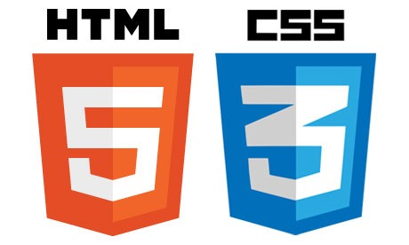
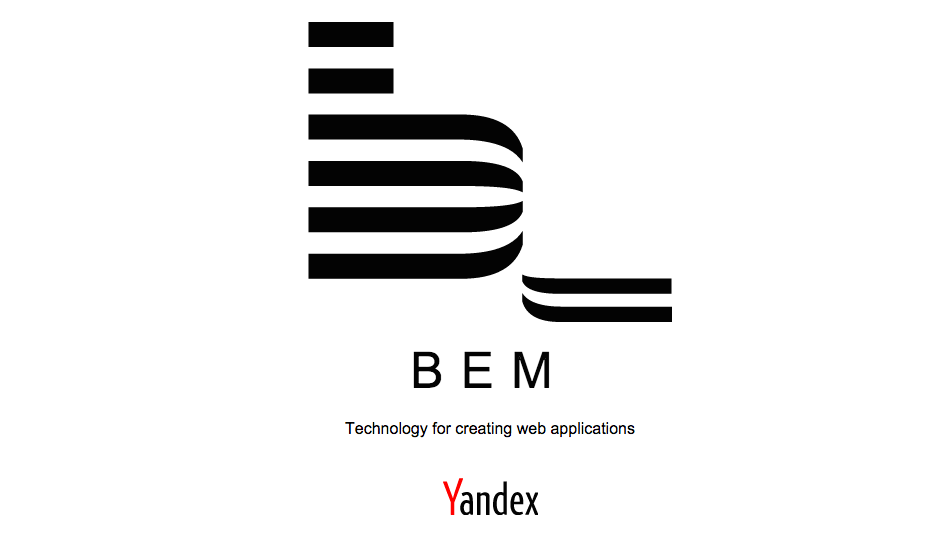
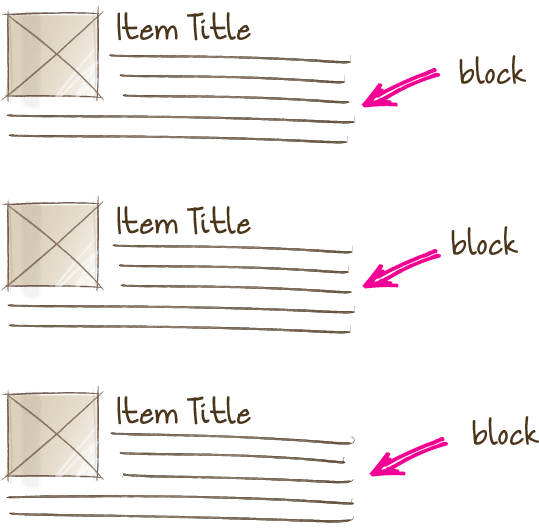
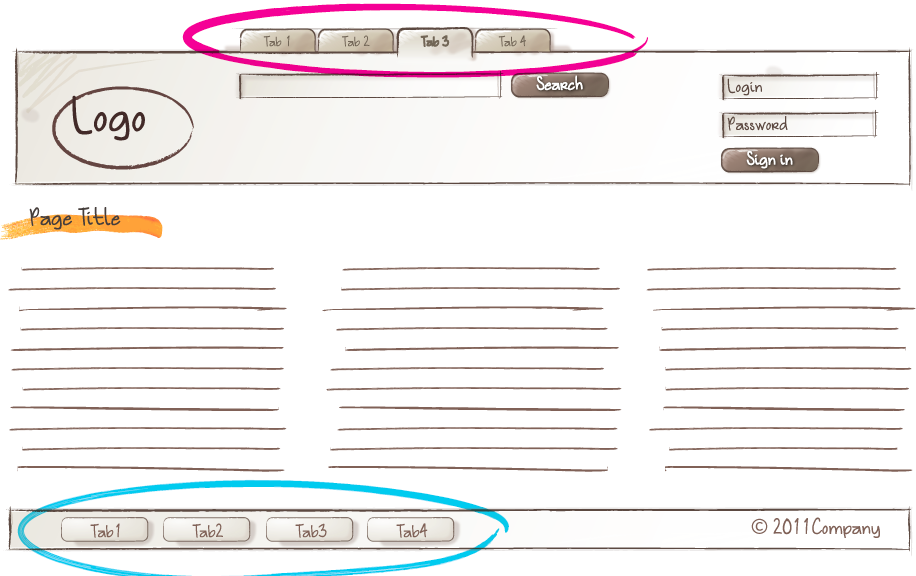
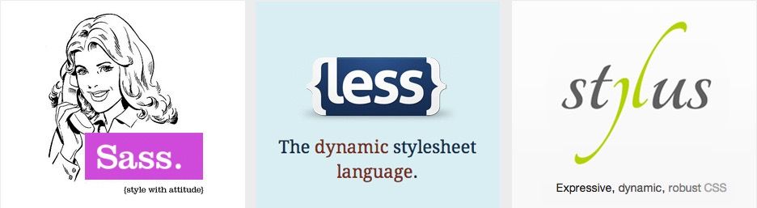
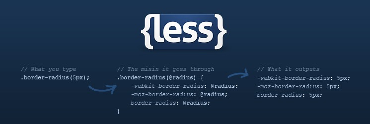
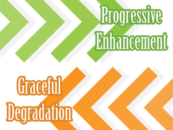
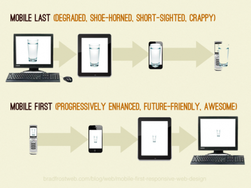
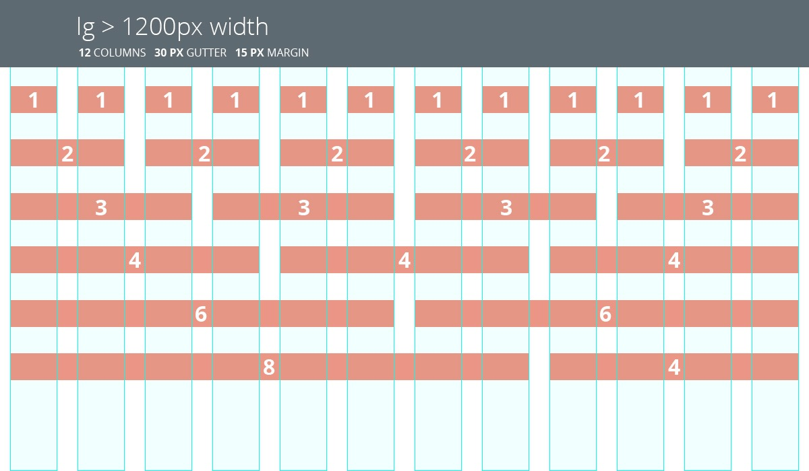

#HSLIDE

### HTML/CSS, часть 2



Сергей Денисов

Старший фронтенд-разработчик


09.02.2017

#HSLIDE

### CSS: [flexbox](https://developer.mozilla.org/en-US/docs/Web/CSS/CSS_Flexible_Box_Layout/Using_CSS_flexible_boxes)


[Пример](https://jsfiddle.net/sergdenisov/95y31w8j/), [статья](http://frontender.info/a-guide-to-flexbox/).

#VSLIDE

Свойства flex-контейнера (родительского элемента):

```css
display: flex | inline-flex
flex-direction: row | row-reverse | column | column-reverse
flex-wrap: nowrap | wrap | wrap-reverse
flex-flow: <'flex-direction'> || <'flex-wrap'>
```

#VSLIDE

```css
justify-content: flex-start | flex-end | center |
                 space-between | space-around
```


#VSLIDE

```css
align-items: flex-start | flex-end | center |
             baseline | stretch
```


#VSLIDE

```css
align-content: flex-start | flex-end | center |
               space-between | space-around | stretch
```


#VSLIDE

Свойства дочерних элементов:

```css
order: <integer>
flex-grow: <number> (default 0)
flex-shrink: <number> (default 1)
flex-basis: <length> | auto (default auto)
flex: [<'flex-grow'> <'flex-shrink'>? || <'flex-basis'>]
      (default 0 1 auto)
align-self: auto | flex-start | flex-end | center |
            baseline | stretch
```

#HSLIDE

### CSS: [animation](https://developer.mozilla.org/en-US/docs/Web/CSS/animation)

```css
animation-name: none
animation-duration: 0s
animation-timing-function: ease
animation-delay: 0s
animation-iteration-count: 1
animation-direction: normal
animation-fill-mode: none
animation-play-state: running
```

#VSLIDE

```css
@keyframes slide-in {
    0% { margin-left: 0; }
    100% { margin-left: 300px; }
}
div {
    width: 100px;
    height: 100px;
    background-color: tomato;
    animation: 3s ease-in 1s infinite slide-in;    
}
```

[Пример](https://jsfiddle.net/sergdenisov/j5ogte1k/1/).

#HSLIDE

### CSS: [transition](https://developer.mozilla.org/en-US/docs/Web/CSS/transition)

```css
transition-delay: 0s
transition-duration: 0s
transition-property: all
transition-timing-function: ease
```

```css
transition: all 3s linear 1s;
```

[Пример](https://jsfiddle.net/sergdenisov/9xrjc710/1/).

#HSLIDE

### CSS: [вендорные префиксы](https://developer.mozilla.org/en-US/docs/Glossary/Vendor_Prefix)

```css
-webkit-transition: margin-left 4s linear 1s;
transition: margin-left 4s linear 1s;
```

[Can I Use?](http://caniuse.com)

#HSLIDE

### CSS: [методологии](http://sixrevisions.com/css/css-methodologies/)

[CSS-методология](http://sixrevisions.com/css/css-methodologies) — способ написания и организации CSS-кода для упрощения
поддержки и масштабирования проекта.

* [Object-Oriented CSS (OOCSS)](http://oocss.org).
* [Scalable and Modular Architecture for CSS (SMACSS)](https://smacss.com).
* [Block, Element, Modifier (BEM)](https://ru.bem.info/methodology/quick-start/).

Полезное: [статья на Хабре](https://habrahabr.ru/post/256109/), [альтернативный сайт про BEM](http://getbem.com).

#HSLIDE

### [Блок Элемент Модификатор](https://ru.bem.info/methodology/quick-start/)



#VSLIDE

### [БЭМ: блок](https://ru.bem.info/methodology/key-concepts/#Блок)


#VSLIDE

### [БЭМ: свободное перемещение блоков](https://ru.bem.info/methodology/key-concepts/#Свободное-перемещение)


#VSLIDE

### [БЭМ: повторное использование блоков](https://ru.bem.info/methodology/key-concepts/#Повторное-использование)



#VSLIDE

### [БЭМ: элемент](https://ru.bem.info/methodology/key-concepts/#Элемент)


#VSLIDE

### [БЭМ: модификатор](https://ru.bem.info/methodology/key-concepts/#Модификатор)



#HSLIDE

### [БЭМ: именование](https://ru.bem.info/methodology/naming-convention/#Соглашение-по-именованию)

* БЭМ-сущностями называются блоки, элементы и модификаторы.
* Имена БЭМ-сущностей записываются с помощью цифр и латинских букв в нижнем регистре.
* Для разделения слов в именах используется дефис (-).
* Для хранения информации об именах блоков, элементов и модификаторов используются CSS-классы.

#VSLIDE

### [БЭМ: имя блока](https://ru.bem.info/methodology/naming-convention/#Имя-блока)

```css
.block-name {
    ...
}
```

```html
<div class="block-name">...</div>
```

#VSLIDE

### [БЭМ: имя элемента](https://ru.bem.info/methodology/naming-convention/#Имя-элемента)

```css
.block-name__element-name {
    ...
}
```

```html
<div class="block-name">...</div>
```

#VSLIDE

### [БЭМ: имя модификатора](https://ru.bem.info/methodology/naming-convention/#Имя-модификатора)

```css
.block-name_modifier-name {
    ...
}
.block-name_modifier-name_modifier-value {
    ...
}
```

```html
<div class="block-name
            block-name_modifier-name">
    ...
</div>
<div class="block-name
            block-name_modifier-name_modifier-value">
    ...
</div>
```

#VSLIDE

### [БЭМ: имя модификатора элемента](https://ru.bem.info/methodology/naming-convention/#Модификатор-элемента)

```css
.block-name__element-name_modifier-name {
    ...
}
.block-name__element-name__modifier-name_modifier-value {
    ...
}
```

```html
<div class="block-name">
    <div class="block-name__element-name
                block-name__element-name_modifier-name">
        ...
    </div>
</div>
<div class="block-name">
    <div class="block-name__element-name
                block-name__element-name__modifier-name_modifier-value">
        ...
    </div>
</div>
```

#VSLIDE

### [БЭМ: пример использования наименований](https://ru.bem.info/methodology/naming-convention/#Пример-использования-соглашения-по-именованию)

```css
.form {}
.form_theme_forest {}
.form_login {}
.form__input {}
.form__submit {}
.form__submit_disabled {}
```

```html
<form class="form form_login form_theme_forest">
    <input class="form__input">
    <input class="form__submit form__submit_disabled">
</form>
```

#VSLIDE

### [БЭМ: миксы](https://ru.bem.info/methodology/key-concepts/#Микс)

Микс — способ использования разных [БЭМ-сущностей](https://ru.bem.info/methodology/key-concepts/#БЭМ-сущность) на одном
элементе.

Миксы позволяют:

* Совмещать поведение и стили нескольких БЭМ-сущностей без дублирования кода.
* Создавать семантически новые компоненты интерфейса на основе имеющихся БЭМ-сущностей.

```html
<div class="menu">

    <span class="menu__item link">...</span>

</div>
```

#HSLIDE

### CSS-методология в HeadHunter

"У нас свой подход, лишь отдалённо напоминающий БЭМ." (c):

* Есть глобальный `reset.css` (сброс дефолтных стилей для всех браузеров).
* Миксы запрещены.
* Модификаторы только булевы.
* Иногда используются глобальные классы.
* Иногда используются глобальные модификаторы.

#HSLIDE

### CSS: [препроцессоры](https://www.urbaninsight.com/2012/04/12/ten-reasons-you-should-be-using-css-preprocessor)

[Препроцессоры](https://habrahabr.ru/sandbox/78148/) компилируют СSS код, который мы пишем на процессорном языке в
чистый, валидный CSS код. Профит:

* Расширяют синтаксис CSS недостающими возможностями.
* Уменьшают дублирование кода.
* Делают код более структурированным.
* Упрощают поддержку кода.

#VSLIDE

### CSS: [популярные препроцессоры](https://www.sitepoint.com/6-current-options-css-preprocessors/)



* [SASS/SCSS](http://sass-lang.com/guide)
* [Stylus](http://stylus-lang.com)
* [LESS](http://lesscss.org/features/#features-overview-feature)

#VSLIDE

### CSS: требования к препроцессору в HeadHunter

* Основные возможности: переменные, миксины, математические операторы и т.д.
* Поддержка Node.js.
* Строгий CSS-синтаксис.
* Поддержка IntelliJ IDEA.
* Поддержка [Source Maps](https://developers.google.com/web/tools/chrome-devtools/javascript/source-maps).
* Парсер синтаксиса, например, [Gonzales PE](https://github.com/tonyganch/gonzales-pe).

#HSLIDE

### [LESS](http://lesscss.org)



#VSLIDE

### LESS: [использование](http://lesscss.org/#using-less)

* [Подключение скрипта](http://lesscss.org/#client-side-usage):

```html
<script src="less.js"></script>
```

* [Через командную строку](http://lesscss.org/#using-less-command-line-usage):

```html
npm install -g less

lessc styles.less
```

* [Через плагин для сборщика](https://www.npmjs.com/package/gulp-less)

#VSLIDE

### LESS: [переменные](http://lesscss.org/features/#features-overview-feature-variables)

```less
@nice-blue: #5B83AD;


#header {
 
    color: @light-blue;

}
```

```css
#header {

    color: #5B83AD;

}
```

#VSLIDE

### LESS: [миксины](http://lesscss.org/features/#features-overview-feature-mixins)

```less
.my-mixin {

    color: black;

}

.my-other-mixin() {

    background: white;

}

.block {

    .my-mixin;

    .my-other-mixin;

}
```

```css
.my-mixin {

    color: black;

}

.block {

    color: black;

    background: white;

}
```

#VSLIDE

### LESS: [параметризированные миксины](http://lesscss.org/features/#mixins-parametric-feature)

```less
.border-radius(@radius: 5px) {

    -webkit-border-radius: @radius;

    border-radius: @radius;

}

.button {

    .border-radius(6px);

}
```

```css


.button {

    -webkit-border-radius: 6px;

    border-radius: 6px;

}
```

#VSLIDE

### LESS: [вложенные правила](http://lesscss.org/features/#features-overview-feature-nested-rules)

```less
#header {

    color: black;

    .navigation {

        font-size: 12px;

    }

    .logo {

        width: 300px;

    }

}
```

```css
#header {

    color: black;

}

#header .navigation {

    font-size: 12px;

}

#header .logo {

    width: 300px;

}
```

#VSLIDE

### LESS: [вложенные директивы и всплытие](http://lesscss.org/features/#features-overview-feature-nested-directives-and-bubbling)

```less
.screen-color {
    @media screen {
        color: green;
        @media (min-width: 768px) {
            color: red;
        }
    }
    @media tv {
        color: black;
    }
}
```

#VSLIDE

### LESS: [родительские селекторы](http://lesscss.org/features/#parent-selectors-feature)

```less
a {
    color: blue;
    &:hover {
        color: green;
    }
}
```

```css
a {
    color: blue;
}
a:hover {
    color: green;
}
```

#VSLIDE

### LESS: [математические операции](http://lesscss.org/features/#features-overview-feature-operations)

```less
// numbers are converted into the same units
@conversion-1: 5cm + 10mm; // result is 6cm
@conversion-2: 2 - 3cm - 5mm; // result is -1.5cm
// conversion is impossible
@incompatible-units: 2 + 5px - 3cm; // result is 4px
// example with variables
@base: 5%;
@filler: @base * 2; // result is 10%
@other: @base + @filler; // result is 15%
```

```less
@base: 2cm * 3mm; // result is 6cm
```

```less
@color: #224488 / 2; //results in #112244
background-color: #112244 + #111; // result is #223355
```

#VSLIDE

### LESS: [функции](http://lesscss.org/features/#features-overview-feature-functions)

```less
@base: #f04615;
@width: 0.5;
.class {
    width: percentage(@width); // returns 50%

    color: darken(@base, 5%);
 // returns #dd3d0e
    background-color: lighten(@base, 10%); // returns #f36c45
}
```

#VSLIDE

### LESS: [циклы](http://lesscss.org/features/#loops-feature)

```less
.loop(@counter) when (@counter > 0) {
    .loop((@counter - 1)); // next iteration
    width: (10px * @counter); // code for each iteration
    }
div {
    .loop(5); // launch the loop
}
```

```css
div {
    width: 10px;
    width: 20px;
    width: 30px;
    width: 40px;
    width: 50px;
}
```

#VSLIDE

### LESS: [импорты](http://lesscss.org/features/#import-directives-feature)

```less
@import "foo"; // foo.less is imported

@import "foo.less"; // foo.less is imported

@import "foo.php";  // foo.php imported as a less file

@import "foo.css";  // statement left in place, as-is


@import (optional, reference) "foo.less";


@import (less) "foo.css";
```

#VSLIDE

### LESS: [комментарии](http://lesscss.org/features/#features-overview-feature-comments)

```less
/* One hell of a block
style comment! */
@var: red;
// Get in line!
@var: white;
```

#HSLIDE

### Использование LESS в HeadHunter

* [Родительские селекторы](http://lesscss.org/features/#parent-selectors-feature) только для элементов, модификаторов,
псевдо-классов и псевдо-элементов.
* [Родительские селекторы](http://lesscss.org/features/#parent-selectors-feature) ограничены 2-мя уровнями.
* Миксины только [со скобками](http://lesscss.org/features/#mixins-feature-not-outputting-the-mixin) (чтобы не было в
выходном файле).
* Не используются: [Extend](http://lesscss.org/features/#extend-feature), [Mixins as Functions](http://lesscss.org/features/#mixins-as-functions-feature),
[Import Options](http://lesscss.org/features/#import-options).

#HSLIDE

### CSS: [Progressive Enhancement / Graceful Degradation](https://habrahabr.ru/post/157115/)



#VSLIDE

### CSS: [Mobile First](https://www.sitepoint.com/introduction-mobile-first-media-queries/)



#HSLIDE

### CSS: [модульные сетки](http://htmlbook.ru/content/modulnaya-setka)

[Модульная сетка](htmlbook.ru/content/modulnaya-setka) представляет собой набор невидимых направляющих, вдоль которых
располагаются элементы страницы. Профит:

* Это облегчает размещение данных в документе.
* Обеспечивает визуальную связь между отдельными блоками.
* Сохраняет преемственность дизайна при переходе от одной страницы к другой.

#VSLIDE

Обычно состоит из:

* Контейнера.
* Строки.
* Ячейки.
* Отступов.

#VSLIDE



Примеры: [Twitter Bootstrap](http://getbootstrap.com/css/#grid), [960 Grid System](http://960.gs).

#VSLIDE

### CSS: [модульная сетка в Twitter Bootstrap](http://getbootstrap.com/css/#grid)

```html
<div class="row">
    <div class="col-md-8">.col-md-8</div>
    <div class="col-md-4">.col-md-4</div>
</div>
<div class="row">
    <div class="col-md-4">.col-md-4</div>
    <div class="col-md-4">.col-md-4</div>
    <div class="col-md-4">.col-md-4</div>
</div>
<div class="row">
    <div class="col-md-6">.col-md-6</div>
    <div class="col-md-6">.col-md-6</div>
</div>
```

#HSLIDE

### Тестирование в браузерах

* Доступные браузеры для своей ОС.
* Мобильные браузеры на физических устройствах.
* [Виртуальные машины](https://developer.microsoft.com/en-us/microsoft-edge/tools/vms/) (в основном, для IE).
* Эмуляторы мобильных устройств, например, в [Xcode](https://developer.apple.com/library/content/documentation/IDEs/Conceptual/iOS_Simulator_Guide/GettingStartedwithiOSSimulator/GettingStartedwithiOSSimulator.html),
[Genymotion](https://www.genymotion.com).
* [Эмуляция устройств в Google Chrome](https://developers.google.com/web/tools/chrome-devtools/device-mode/).

#HSLIDE

### Ссылки

* [БЭМ](https://ru.bem.info/method/key-concepts/)
* [LESS](http://lesscss.org)
* [Twitter Bootstrap Grid](http://getbootstrap.com/css/#grid)

#HSLIDE

### Спасибо за внимание!

Любите CSS, а то CSS не будет любить вас!


