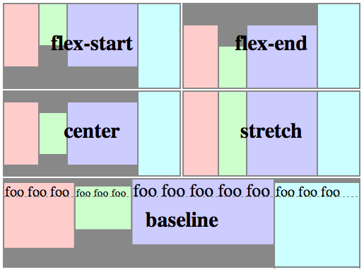
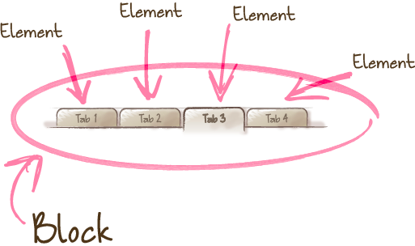

#HSLIDE

### HTML/CSS, часть 2


Сергей Денисов

Старший фронтенд-разработчик


09.02.2017

#HSLIDE

### CSS: [flexbox](https://developer.mozilla.org/en-US/docs/Web/CSS/CSS_Flexible_Box_Layout/Using_CSS_flexible_boxes)


[Пример](https://jsfiddle.net/sergdenisov/95y31w8j/), [статья](http://frontender.info/a-guide-to-flexbox/).

#VSLIDE

Свойства flex-контейнера (родительского элемента):

```css
display: flex | inline-flex
flex-direction: row | row-reverse | column | column-reverse
flex-wrap: nowrap | wrap | wrap-reverse
flex-flow: <'flex-direction'> || <'flex-wrap'>
```

#VSLIDE

```css
justify-content: flex-start | flex-end | center |
                 space-between | space-around
```


#VSLIDE

```css
align-items: flex-start | flex-end | center |
             baseline | stretch
```



#VSLIDE

```css
align-content: flex-start | flex-end | center |
               space-between | space-around | stretch
```


#VSLIDE

Свойства дочерних элементов:

```css
order: <integer>
flex-grow: <number> (default 0)
flex-shrink: <number> (default 1)
flex-basis: <length> | auto (default auto)
flex: [<'flex-grow'> <'flex-shrink'>? || <'flex-basis'>]
      (default 0 1 auto)
align-self: auto | flex-start | flex-end | center |
            baseline | stretch
```

#HSLIDE

### CSS: [animation](https://developer.mozilla.org/en-US/docs/Web/CSS/animation)

```css
animation-name: none
animation-duration: 0s
animation-timing-function: ease
animation-delay: 0s
animation-iteration-count: 1
animation-direction: normal
animation-fill-mode: none
animation-play-state: running
```

#VSLIDE

```css
@keyframes slide-in {
    0% { margin-left: 0; }
    100% { margin-left: 300px; }
}
div {
    width: 100px;
    height: 100px;
    background-color: tomato;
    animation: 3s ease-in 1s infinite slide-in;    
}
```

[Пример](https://jsfiddle.net/sergdenisov/j5ogte1k/1/).

#HSLIDE

### CSS: [transition](https://developer.mozilla.org/en-US/docs/Web/CSS/transition)

```css
transition-delay: 0s
transition-duration: 0s
transition-property: all
transition-timing-function: ease
```

```css
transition: all 3s linear 1s;
```

[Пример](https://jsfiddle.net/sergdenisov/9xrjc710/1/).

#HSLIDE

### CSS: [вендорные префиксы](https://developer.mozilla.org/en-US/docs/Glossary/Vendor_Prefix)

```css
-webkit-transition: margin-left 4s linear 1s;
transition: margin-left 4s linear 1s;
```

[Can I Use?](http://caniuse.com)

#HSLIDE

### CSS: [методологии](http://sixrevisions.com/css/css-methodologies/)

[CSS-методология](http://sixrevisions.com/css/css-methodologies) — способ написания и организации CSS-кода для упрощения
поддержки и масштабирования проекта.

* [Object-Oriented CSS (OOCSS)](http://oocss.org).
* [Scalable and Modular Architecture for CSS (SMACSS)](https://smacss.com).
* [Block, Element, Modifier (BEM)](https://ru.bem.info/methodology/quick-start/).

Полезное: [статья на Хабре](https://habrahabr.ru/post/256109/), [альтернативный сайт про BEM](http://getbem.com).

#HSLIDE

### [Блок Элемент Модификатор](https://ru.bem.info/methodology/quick-start/)


#VSLIDE

### [БЭМ: блок](https://ru.bem.info/methodology/key-concepts/#Блок)


#VSLIDE

### [БЭМ: свободное перемещение блоков](https://ru.bem.info/methodology/key-concepts/#Свободное-перемещение)


#VSLIDE

### [БЭМ: повторное использование блоков](https://ru.bem.info/methodology/key-concepts/#Повторное-использование)


#VSLIDE

### [БЭМ: элемент](https://ru.bem.info/methodology/key-concepts/#Элемент)



#VSLIDE

### [БЭМ: модификатор](https://ru.bem.info/methodology/key-concepts/#Модификатор)


#HSLIDE

### [БЭМ: именование](https://ru.bem.info/methodology/naming-convention/#Соглашение-по-именованию)

* БЭМ-сущностями называются блоки, элементы и модификаторы.
* Имена БЭМ-сущностей записываются с помощью цифр и латинских букв в нижнем регистре.
* Для разделения слов в именах используется дефис (-).
* Для хранения информации об именах блоков, элементов и модификаторов используются CSS-классы.

#VSLIDE

### [БЭМ: имя блока](https://ru.bem.info/methodology/naming-convention/#Имя-блока)

```css
.block-name {
    ...
}
```

```html
<div class="block-name">...</div>
```

#VSLIDE

### [БЭМ: имя элемента](https://ru.bem.info/methodology/naming-convention/#Имя-элемента)

```css
.block-name__element-name {
    ...
}
```

```html
<div class="block-name">...</div>
```

#VSLIDE

### [БЭМ: имя модификатора](https://ru.bem.info/methodology/naming-convention/#Имя-модификатора)

```css
.block-name_modifier-name {
    ...
}
.block-name_modifier-name_modifier-value {
    ...
}
```

```html
<div class="block-name
            block-name_modifier-name">
    ...
</div>
<div class="block-name
            block-name_modifier-name_modifier-value">
    ...
</div>
```

#VSLIDE

### [БЭМ: имя модификатора элемента](https://ru.bem.info/methodology/naming-convention/#Модификатор-элемента)

```css
.block-name__element-name_modifier-name {
    ...
}
.block-name__element-name__modifier-name_modifier-value {
    ...
}
```

```html
<div class="block-name">
    <div class="block-name__element-name
                block-name__element-name_modifier-name">
        ...
    </div>
</div>
<div class="block-name">
    <div class="block-name__element-name
                block-name__element-name__modifier-name_modifier-value">
        ...
    </div>
</div>
```

#VSLIDE

### [БЭМ: пример использования наименований](https://ru.bem.info/methodology/naming-convention/#Пример-использования-соглашения-по-именованию)

```css
.form {}
.form_theme_forest {}
.form_login {}
.form__input {}
.form__submit {}
.form__submit_disabled {}
```

```html
<form class="form form_login form_theme_forest">
    <input class="form__input">
    <input class="form__submit form__submit_disabled">
</form>
```

#VSLIDE

### [БЭМ: миксы](https://ru.bem.info/methodology/key-concepts/#Микс)

Микс — способ использования разных [БЭМ-сущностей](https://ru.bem.info/methodology/key-concepts/#БЭМ-сущность) на одном
элементе.

Миксы позволяют:

* Совмещать поведение и стили нескольких БЭМ-сущностей без дублирования кода.
* Создавать семантически новые компоненты интерфейса на основе имеющихся БЭМ-сущностей.

```html
<div class="menu">

    <span class="menu__item link">...</span>

</div>
```

#HSLIDE

### CSS-методология в HeadHunter

"У нас свой подход, лишь отдалённо напоминающий БЭМ." (c):

* Есть глобальный `reset.css` (сброс дефолтных стилей для всех браузеров).
* Миксы запрещены.
* Модификаторы только булевы.
* Иногда используются глобальные классы.
* Иногда используются глобальные модификаторы.
